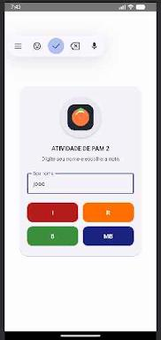

# Logcat Button - Atividade de PAM 2

Projeto Android desenvolvido em Kotlin utilizando Jetpack Compose para demonstrar a interação entre a interface do usuário e o sistema de monitoramento de eventos do Android (Logcat).

## Demonstração da Interface

Abaixo, a visualização da interface principal do aplicativo:



---

## Saída de Dados (Logcat)

O print abaixo demonstra a captura dos eventos no console do Android Studio, evidenciando as diferentes prioridades de log configuradas para cada menção:


---

## Descrição do Projeto

O aplicativo solicita o nome do usuário e permite a seleção de uma nota (I, R, B ou MB). Cada botão dispara uma mensagem personalizada no sistema de logs do Android, utilizando cores e níveis de prioridade distintos para facilitar a depuração.

## Identificação do Pacote

```kotlin
package com.example.logcatbutton
